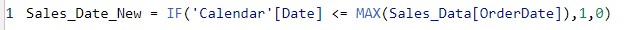
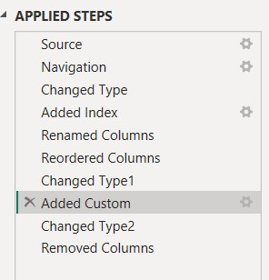
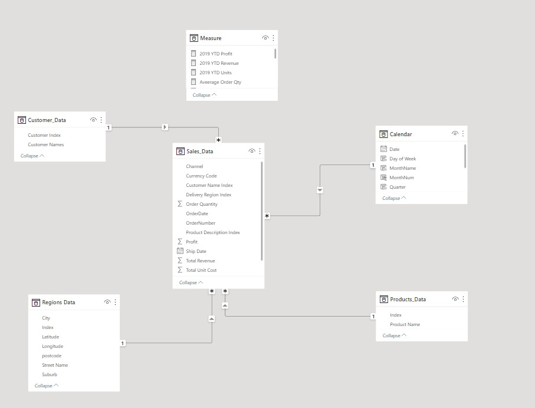
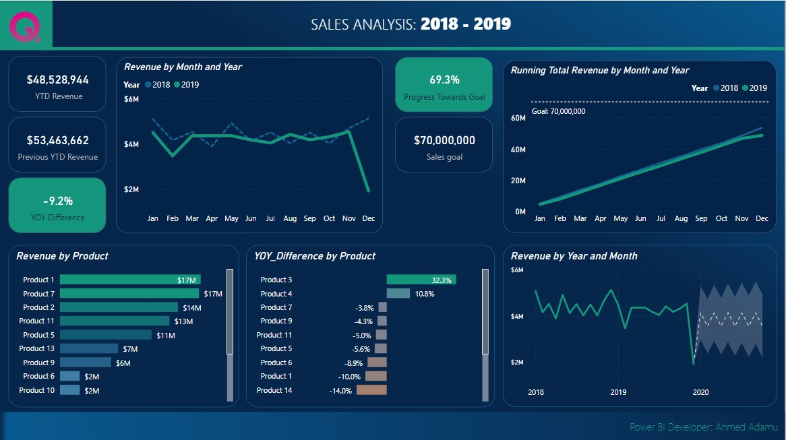

# Sales, Product and Region-Performance

## Introduction
This is an analysis of **Sales Performance**, **Product Performance** and **Region Performance** for the year 2017 to 2018 using Power BI. The data source was a simple excel file which was Imported to Power BI for this analysis. There were 3 tables used, Sales table, Product table & Regions table. Two extra tables were created, 1 for all the measures created and the 2nd a calendar table to all necessary dates.

## Problem Statement

The aim of this analysis is to answer the following Business related questions

- Find the sales, product and region performance of 2018 and 2019?
- Do a forecast to the revenue for 2020?
- Ascertain the products that generated the highest revenue for 2019?
- Do a year on year analysis for sales and product performamce
- Did the revenue for both 2018 & 2019 reach their target for the year?

# Skills & Concept used:

- Data Modelling
- Power Query (Data Transformation)
- DAX
- Tooltip 
- Filters
- Calculated Columns
- Conditional Formating
- Data Visualization & Design (Using appropriate visuals to send appropriate message to stakeholders)

# Data Source

A simple Excel file was imported to Power BI.

# Data Transformation/Cleaning/Manipulation:

Transformation took place using power query. Column quality/distribution was checked for nulls and duplicates. A calculated column was created to get the revenue and profit column from price and quantity columns. 

Also, A calendar table was created to build all necessary dates and a calculated column using DAX to tally the calendar date with the sales date.

Additional transformation was also carried out on power query.

# Data Modelling:

By default, Power BI automatically connects different tables using its intelligence; however, this connection doesn't always yield what you want. Hence it is best practice to do the connection yourself and use the star schema approach. I manually modelled the data using 1 to many relationships among the tables(Sales table was the fact table, while customer, products, Regions, calendar were dimension tables)

# Sales Performance Visualization

Appropriate charts were used to give insights about the sales performance between 2018 and 2019. Cards, Line Charts and Bar Charts were used to give insights. Filters were used to ensure the sales date was equal to the calendar date inorder not to have dates outside the sales date. Doing this will avoid blanks appearing for dates that have no sales. Also, the filter on all pages was used to exclude the year 2017 as this analysis was focusing on 2018 & 2019 respectively.

