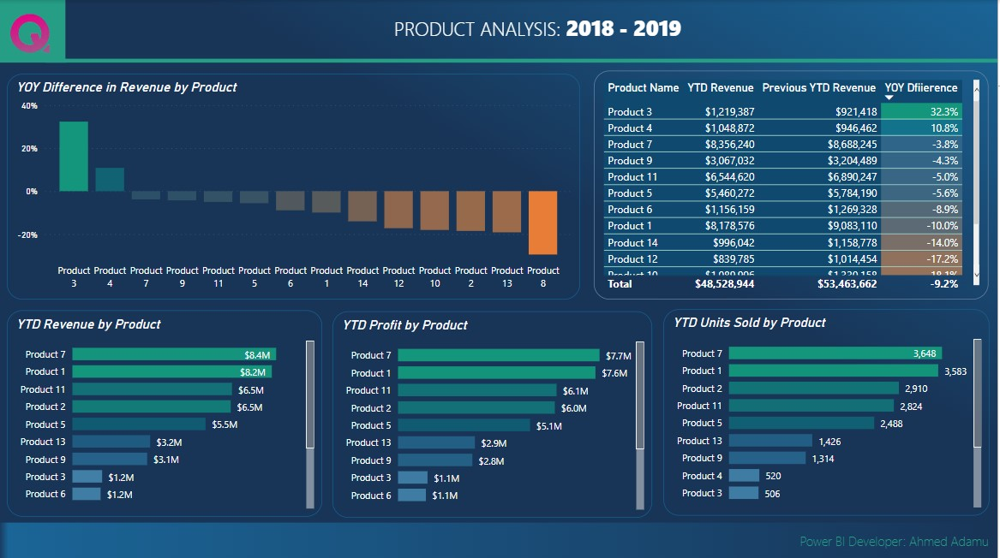
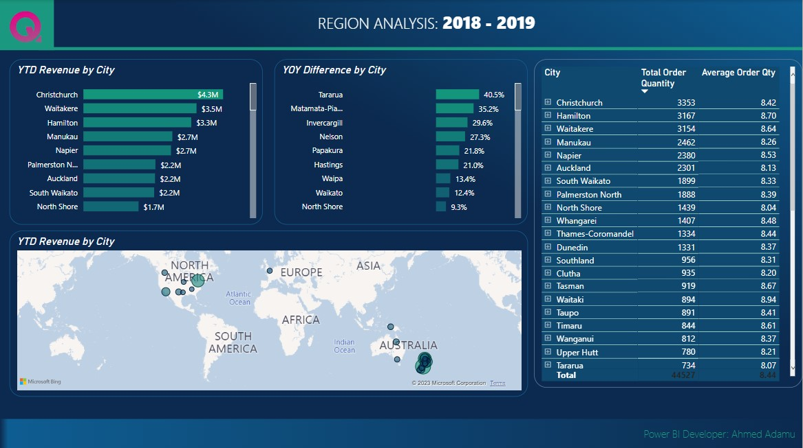
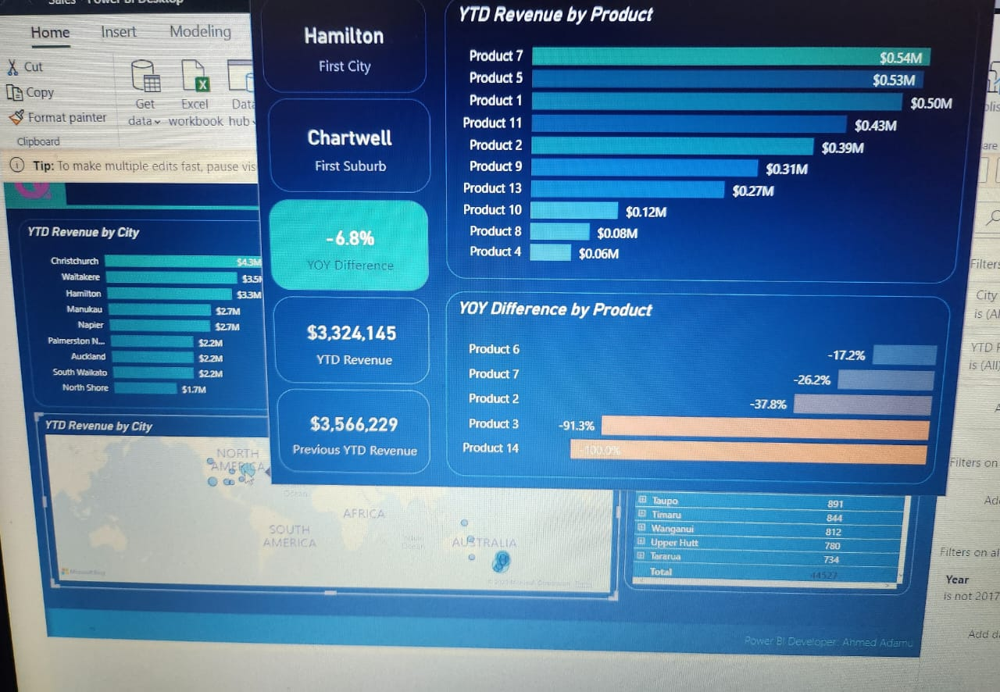

# Sales, Product and Region-Performance

## Introduction
This is an analysis of **Sales Performance**, **Product Performance** and **Region Performance** for the year 2017 to 2018 using Power BI. The data source was a simple excel file which was Imported to Power BI for this analysis. There were 3 tables used, Sales table, Product table & Regions table. Two extra tables were created, 1 for all the measures created and the 2nd a calendar table to all necessary dates.

## Problem Statement

The aim of this analysis is to answer the following Business related questions

- Find the sales, product and region performance of 2018 and 2019?
- What will be the forecast for Dec 2020 revenue?
- Ascertain the products that generated the highest revenue for 2019?
- Do a year on year analysis for sales and product performamce?
- Did the revenue for 2019 reach their target for the year?
- What region generated the highest revenue?

# Skills & Concept used:

- Data Modelling
- Power Query (Data Transformation)
- DAX
- Tooltip 
- Filters
- Calculated Columns
- Conditional Formating
- Data Visualization & Design (Using appropriate visuals to send appropriate message to stakeholders)

# Data Source

A simple Excel file was imported to Power BI.

# Data Transformation/Cleaning/Manipulation:

Transformation took place using power query. Column quality/distribution was checked for nulls and duplicates. A calculated column was created to get the revenue and profit column from price and quantity columns. 

Also, A calendar table was created to build all necessary dates and a calculated column using DAX to tally the calendar date with the sales date.

Additional transformation was also carried out on power query.

# Data Modelling:

By default, Power BI automatically connects different tables using its intelligence; however, this connection doesn't always yield what you want. Hence it is best practice to do the connection yourself and use the star schema approach. I manually modelled the data using 1 to many relationships among the tables(Sales table was the fact table, while customer, products, Regions, calendar were dimension tables)

# Sales Performance Visualization

Appropriate charts were used to give insights about the sales performance between 2018 and 2019. Cards, Line Charts and Bar Charts were used to give insights. Filters were used to ensure the sales date was equal to the calendar date inorder not to have dates outside the sales date. Doing this will avoid blanks appearing for dates that have no sales. Also, the filter on all pages was used to exclude the year 2017 as this analysis was focusing on 2018 & 2019 respectively.

# Product Performance Visualization

Visual charts were created to answer the business case questions about product performance and year on year comparison of products bewtween 2018 and 2019. Conditional formatting was used to signify products that were peroforming and generating more revenue from non performing products.

# Region Performance Visualization

For this visuals, a combination of bar charts, tables and map were used to tell the story. This showed how much revenue was generated across various regions.

In addition to this, I made use of the tool tip feature. This feature pops up when stakeholders hover around any bubble point on the map see in details revenue generated by top selling products in that region, also the year on year diff and many more relevant key information.

# Insights

- Revenue generated was $48,528.944 and $53,463.662 for the year 2019 and 2018 respectively.
- Revenue for 2019 was 30.7% away from meeting the goal for the year.
- The forecast for Dec 2020 Revenue was $3,550,000.
- Year-on-year diff was -9.2%.
- The product that generated the highest revenue was product 1 at $17,000,000
- The product that generated the highest profit was product 7 at $7,700,000
- Product 7 had the highest units sold at 3,648
- Christchurch city generated the highest revenue at $4,300,000 and had the highest order quantity at 3,353.

# Recommendations

- A year-on-year difference of -9.2% may indicate that the company is experiencing some challenges. It may be helpful to identify the reasons for this difference and develop strategies to address them.
- Since Product 1 generated the highest revenue and Product 7 generated the highest profit, it may be beneficial to use same strategy that made these products generate high revenue & profit across non performing products. For example, the company could invest in marketing and advertising campaigns to increase awareness of these products and their benefits.
- Since the revenue generated for 2019 was 30.7% away from meeting the goal, it may be worth reviewing and adjusting the revenue goal for 2020 to make it more realistic and achievable.
